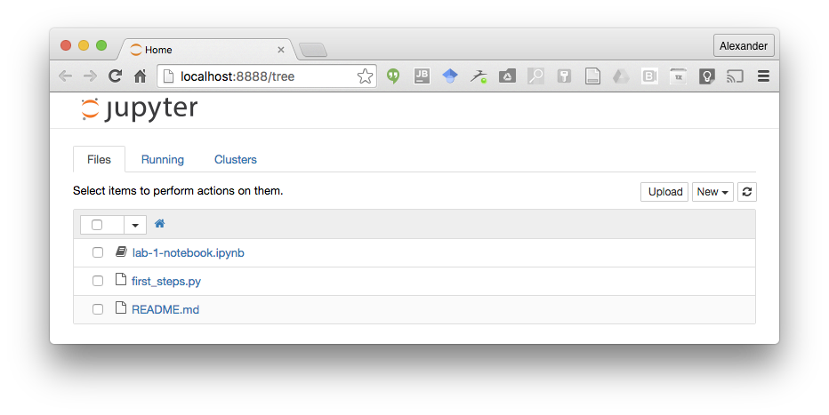

# Introduction to Data Science - Lab 1

Hi there, welcome to this class! In the labs we'll work on practical skills related to what we discuss in the lectures. That means we'll write code, and we'll write this code in a programming language called Python.

Python has three advantages for this class: it's pretty easy to learn, it's the language of choice for many data scientists, and it can be used inside of Jupyter Notebooks - more on the latter will follow later.

First, we'll need to install some things:

## Installing Python

Chances are, if you're on a mac, you already have Python installed. You can simply try it out by running

```
$ python
```

from a console. However, as most software, Python comes in different versions and is packaged differently depending on your needs. In this class we'll use a python distribution called Anaconda. Anaconda comes with a lot of packages that we'll need pre-installed, so it should be the most hassle-free option for us.

Go to [this website](https://docs.continuum.io/anaconda/install) and install anaconda for Python 3.5 for your operating system.

Once you've installed anaconda, close your terminal window and re-open it - otherwise your terminal won't recognize the anaconda commands.

Anaconda is both, a package manager and an environment manager. A package manager manages, well, packages. Packages add specific pieces of functionality - there are packages for web scraping, or for data visualization, for example. An environment manager, in contrast, allows you to have different versions of packages installed at the same time. We'll dive into environments and packages when we need them at a later point.

Let's see whether Anaconda works as intended. Run:

```
$ conda --version
```

from your terminal. You should see something like this as a result:

```
$ conda --version
conda 4.0.5
```

You can also check out the [official website](http://conda.pydata.org/docs/test-drive.html) for more details on anaconda, environments, and packages.

## Executing your first program

Now it's time to run python! Open a terminal and execute:

```
$ python
```

You'll see something like that:

```
$ python
Python 3.5.1 |Continuum Analytics, Inc.| (default, Jun 15 2016, 16:14:02)
[GCC 4.2.1 Compatible Apple LLVM 4.2 (clang-425.0.28)] on darwin
Type "help", "copyright", "credits" or "license" for more information.
>>>
```
What does this tell us? It shows us the version number of Python (3.5.1), and we can see that we've installed the Anaconda version from Continuum Analytics. At the end of this statement, you see the thre >>> signs: these indicate a promt, but it looks different from your console promt ($), to indicate you're in an interactive python environment.

There are two fundamental ways you can run Python: in interactive mode (what we're doing here) or in batch mode. In interactive mode you write your program interactively, i.e., each new statement is interpreted as you type it. If you just run ```python``` without any other parameter, you enter the **interactive** mode. Let's write our very first program:

```
>>> print("Hello World!")
Hello World!
```

"Hello World!" is by tradition the very first program that you should write in a new programming language! And see, when we instructed python to print the text "Hello World!", it did just that.

So, let's briefly take that statement apart: it contains a call to the "print" function and passes a parameter to that print function, the string "Hello World!". Given that information, python knows you want to print the string, and it does exactly that.
Print is a built-in function of python, there are several built-in functions, which you can check out [here](https://docs.python.org/3/library/functions.html).

Let's define our first variable. Type

```
>>> my_string_var = "Are you still spinning?"
```

This statement is executed without any feedback. What you're doing here, intuitively, is that first, you create a new variable of type string with the name ```my_string_var```, and then you assign a value to it, "Are you still spinning?". We now can print this variable:

```
>>> print(my_string_var)
Are you still spinning?
```

which produces the result we expected!

There are many different types of variables, not only strings. For example, Python has three different data types for numbers (integers, floats - that represent real numbers, and complex). Check out the details about the built-in data types [here](https://docs.python.org/3/library/stdtypes.html).

Let's start with a simple example:

```
>>> a = 3
>>> b = 2.5
>>> c = a + b
>>> print(c)
5.5
```

Here we've created three variables (`a, b, c`) and executed an operation, the addition of `a` and `b` using the `+` operator, which we have then assigned to `c`. Finally, we've printed `c`.

The data types of `a` and `b`, however, are subtly different. `a` is an integer and `b` is a float. We can check the data type of any variable using the `type()` function:

```
>>> a = 3
>>> type(a)
<class 'int'>
>>> b = 2.5
<class 'float'>
>>> c = "hello"
>>> type(c)
<class 'str'>
```

Python supports many operations, including divisions, type conversions, etc. - we'll explore those soon.

### Exercise: Data types and operations

Play around with data types and operations. Try the following things:

 * Define a variable and assign an integer and a float. Define a new variable and assign the sumo of the previous variables. What's the data type of the third variable?
 * Reassign a variable with a different data type, e.g., take one of your numerical variables and assign a string to it. What's the new data type?
 * Try what happens if you try to add a string to a string?
 * Try what happens if you add a string to a float or an integer.


## Writing code in a file

For now, though, let's look at another way to run python: by executing a file. Exit the interactive environment, by calling the exit function:

```
exit()
```

Now, open up your favorite text editor (if you don't have one, check out, e.g., [Atom](https://atom.io/)) and create a new file called "first_steps.py". We've created such a file for you [here](first_steps.py).

You can also copy and paste this code into the file:

```python
def doubleNumber(a):
    # btw, here is a comment! Use the # symbol to add comments or temporarily remove code
    # shorthand operator for 'a = a * 2'
    # also btw - the indentation here matters!
    a *= 2
    return a;

print(doubleNumber(3))
print(doubleNumber(14.22))
```

Here we've also defined or first own function! We'll go into details about functions at a later time. For now, just notice that the indentation matters!

Now, run

```
$ python first_steps.py
6
28.44
```

What happened here? Python executed the commands in the file, and then terminated. You saw the result, but it was not interactive anymore, but executed in a couple of milliseconds.

Larger and bigger programs are commonly written using source code files and are not run interactively. They will read data from files and wait for user input, etc.

### Exercise: Running Programs

 * Create a new file and use the simple function as a template. Modify the code to divide numbers by two instead of doubling them.
 * Try what happens if you change the indentation. Can you guess what's happening?
 * Try what happens if you print `a` at the very end of the program. Can you explain what's going on?


## Jupyter Notebooks

***Check out the official Jupyter Notebooks documentation [here](http://jupyter.readthedocs.io/en/latest/index.html) for all the details***

Another alternative of running Python, however, is through Jupyter Notebooks. In this class we'll mainly use notebooks as they are great for the data science process and education, but you should be aware of the other options we discussed here.

We've prepared a notebook for the rest of this class. Notebooks are stored in files that end with a `.ipynb` extension. Download [this file](lab-1-notebook.ipynb) and save it to a folder.

Notebooks make use of an improved, interactive client for python called [ipython](https://ipython.org/). ipython might already be installed on your machine, but probably not in the right version. We'll use anaconda to install the proper version of ipython. Run:

```
$ conda install ipython
```

and confirm the installation after reviewing that in fact, ipython 3.* is installed.

Now, change directories in your console to that you're in the directory where the notebook file is saved and run:

```
$ jupyter notebook
```
This will start the notebook server and should open up a browser window point to [http://localhost:8888/](http://localhost:8888/) that will look like that:



Click on the `lab-1-notebook.ipynb` entry, and we'll take it from there! 
